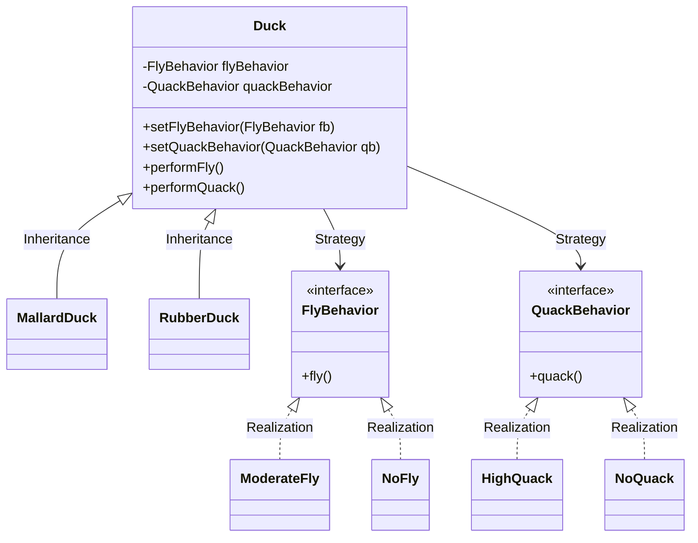

```mermaid
classDiagram
    direction TB

    %% Left Side: Duck Hierarchy
    class Duck {
        -FlyBehavior flyBehavior
        -QuackBehavior quackBehavior
        +setFlyBehavior(FlyBehavior fb)
        +setQuackBehavior(QuackBehavior qb)
        +performFly()
        +performQuack()
    }
    
    Duck <|-- MallardDuck : Inheritance
    Duck <|-- RubberDuck : Inheritance
    
    %% Center/Right: Behavior Interfaces
    class FlyBehavior {
        <<interface>>
        +fly()
    }
    class QuackBehavior {
        <<interface>>
        +quack()
    }
    
    %% Associations
    Duck --> FlyBehavior : Strategy
    Duck --> QuackBehavior : Strategy

    %% Bottom: Concrete Implementations
    FlyBehavior <|.. ModerateFly : Realization
    FlyBehavior <|.. NoFly : Realization
    
    QuackBehavior <|.. HighQuack : Realization
    QuackBehavior <|.. NoQuack : Realization

    class MallardDuck
    class RubberDuck
    class ModerateFly
    class NoFly
    class HighQuack
    class NoQuack
```
