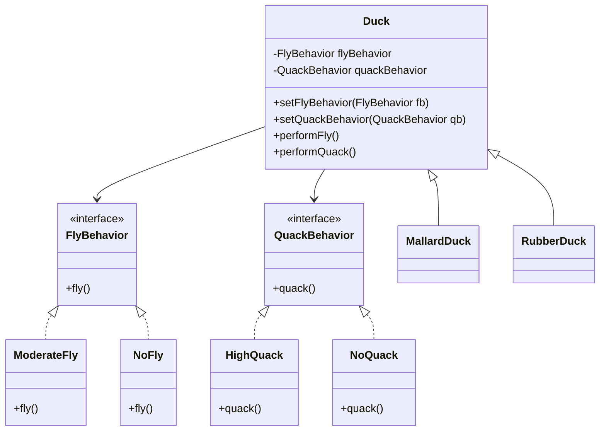

```mermaid
classDiagram
    class Duck {
        -FlyBehavior flyBehavior
        -QuackBehavior quackBehavior
        +setFlyBehavior(FlyBehavior fb)
        +setQuackBehavior(QuackBehavior qb)
        +performFly()
        +performQuack()
    }
    class FlyBehavior {
        <<interface>>
        +fly()
    }
    class QuackBehavior {
        <<interface>>
        +quack()
    }
    class ModerateFly {
        +fly()
    }
    class NoFly {
        +fly()
    }
    class HighQuack {
        +quack()
    }
    class NoQuack {
        +quack()
    }
    class MallardDuck {
    }
    class RubberDuck {
    }
    Duck --> FlyBehavior
    Duck --> QuackBehavior
    Duck <|-- MallardDuck
    Duck <|-- RubberDuck
    FlyBehavior <|.. ModerateFly
    FlyBehavior <|.. NoFly
    QuackBehavior <|.. HighQuack
    QuackBehavior <|.. NoQuack
```
